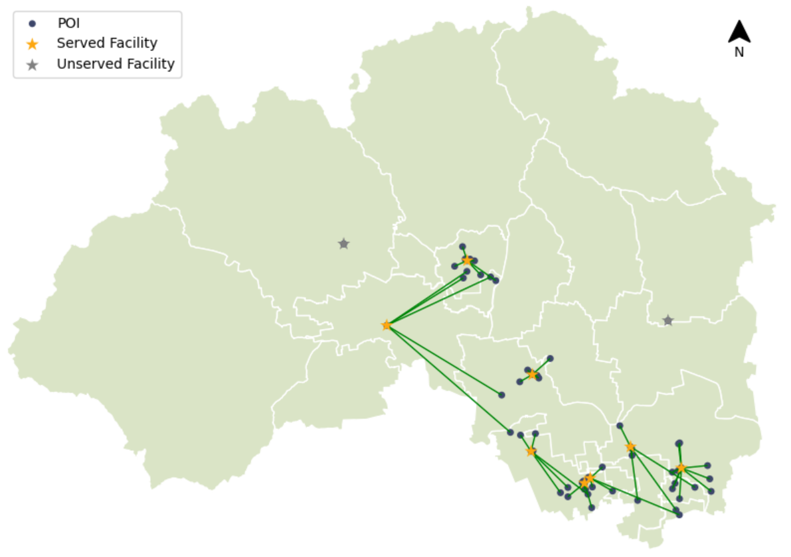
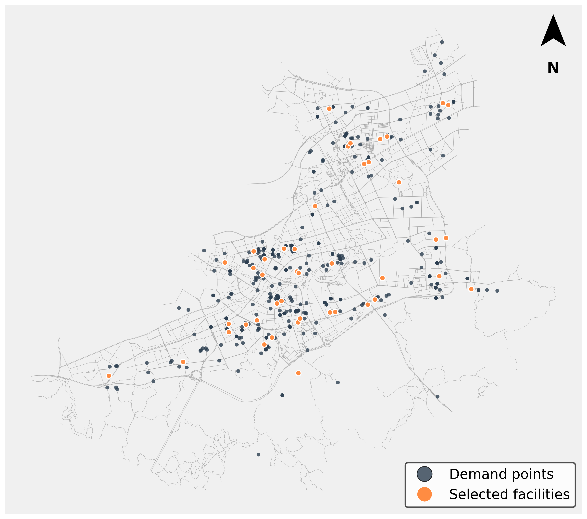
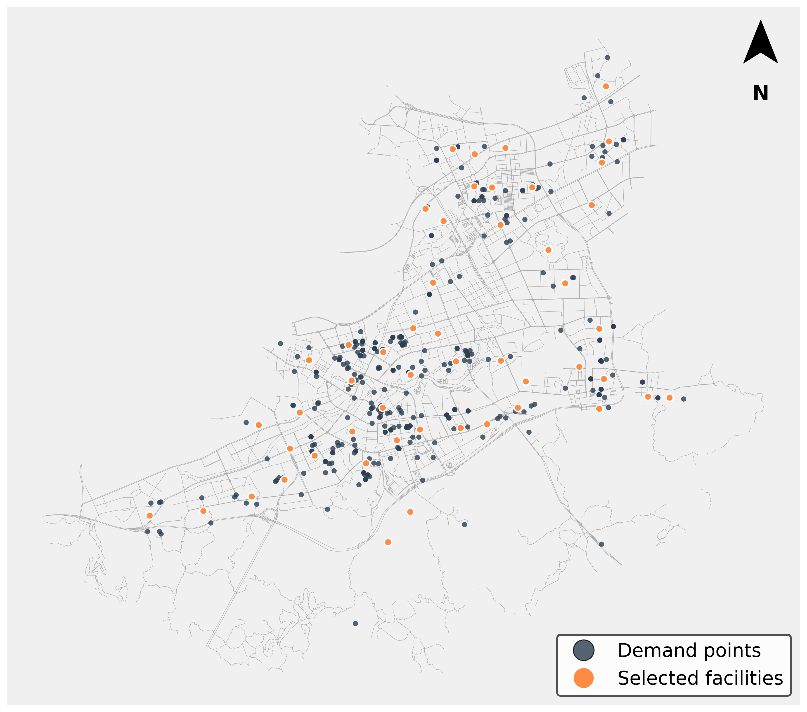
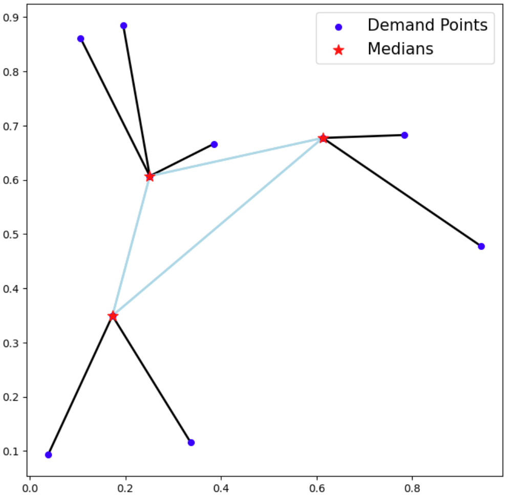
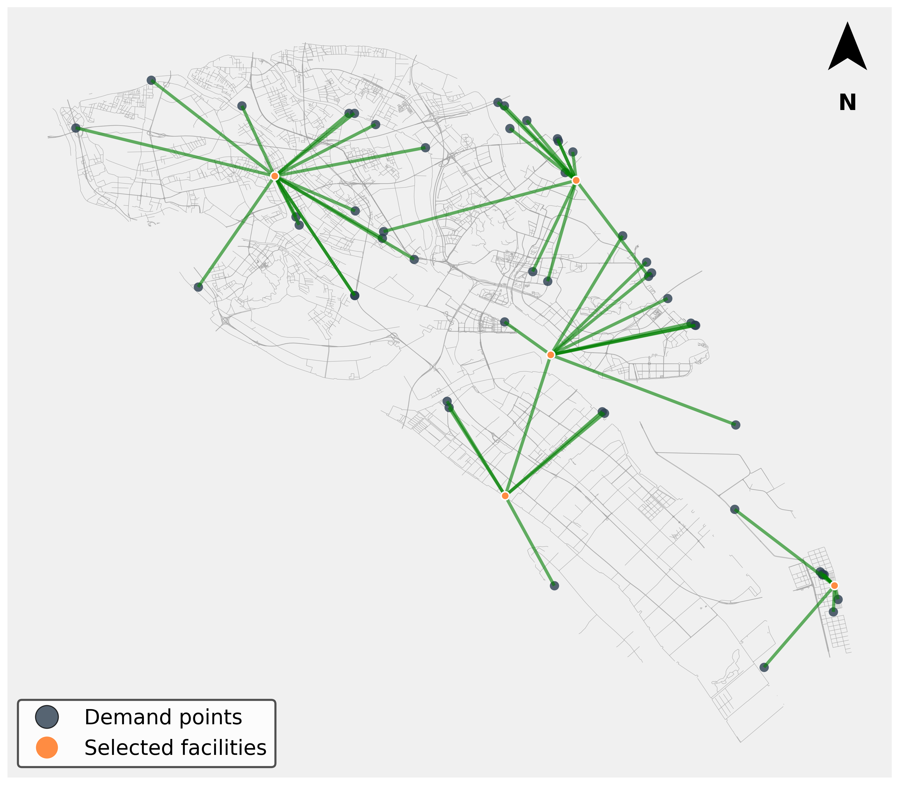
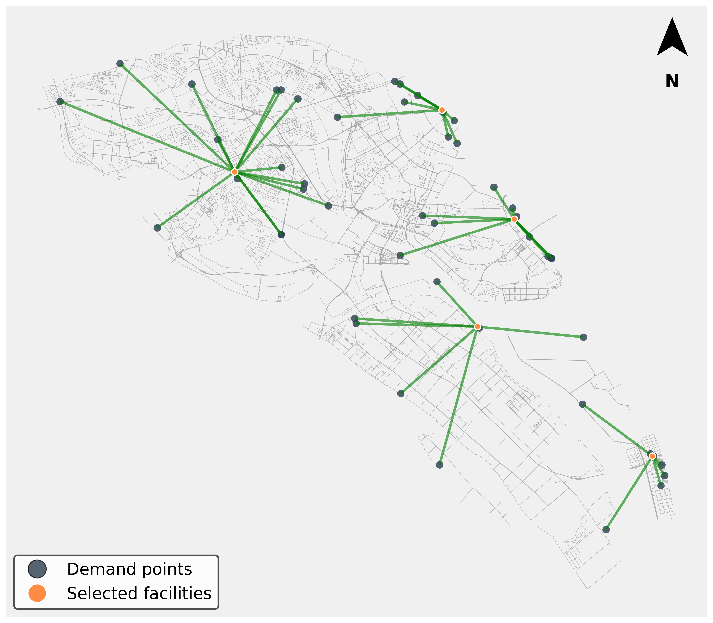

**Languages / 语言:** **English** | [简体中文](README.zh-CN.md)

<div align="center">


### HiGISX Team

**HiSpot** — An integrated Python framework for spatial optimization in urban analytics

[](https://www.python.org/)
[](https://github.com/HIGISX/hispot)

[Overview](#overview) · [Quick start](#quick-start) · [Example notebooks](#example-notebooks) · [DRL experiments](#drl-experiments) · [Local setup & installation](#local-setup--installation) · [Related repositories](#related-higisx-repositories)

</div>

---

## Overview

**HiSpot** (*High Intelligence Spatial Optimization*) provides a **reproducible, extensible** pipeline for classical spatial optimization tasks—including facility location, coverage service design, and location–routing—from geospatial data handling and model formulation to solving and visualization, within a cohesive object-oriented API. This reduces the friction of stitching together commercial GIS, external solvers, and ad hoc glue code.

This repository accompanies the manuscript **“HiSpot: An Integrated and Accessible Python Framework for Spatial Optimization in Urban Analytics”** (anonymous draft `Manuscript_anonymous.docx`). The paper positions HiSpot as a unified workbench that connects data preparation, model specification, solution generation, and cartographic presentation; it supports facility location problems (FLP), coverage models (e.g. MCLP / LSCP), location–routing (LRP), and interoperability with common geospatial data structures, together with benchmark-style datasets and multi-scale real road-network instances for comparison and replication.

> **Abstract (from the manuscript)**  
> Spatial optimization plays a pivotal role in urban analytics, underpinning critical decisions from facility siting to logistics routing. HiSpot is introduced as an open-source Python framework that unifies data processing, model formulation, solution generation, and visualization within a cohesive, object-oriented API, supporting FLP, coverage models (MCLP/LSCP), and LRP, coupled with standard geospatial structures and benchmark datasets for reproducible research.

**Keywords (manuscript):** HiSpot; spatial optimization; integrated workflow; open-source Python library; urban analytics; reproducible research

---

## Capabilities

| Area | Description |
|------|-------------|
| **FLP** | p-median, p-center, p-dispersion, p-hub, uncapacitated / capacitated facility location, and more |
| **Coverage** | MCLP, LSCP, BCLP, MEXCLP, and related extensions |
| **LRP** | Joint facility location and vehicle routing (via `pulp` and compatible solvers) |
| **Visualization** | Plotting assignments and facilities with GeoPandas, geoplot, Matplotlib, etc. |

### Gallery (example maps)

<p align="middle">
  
  
  
</p>

<p align="middle">
  
  
  
</p>

> If `img/` assets are missing locally, sync them from the remote repository or regenerate figures by running the notebooks.

---

## Quick start

With Python and (optionally) Jupyter installed:

```bash
git clone https://github.com/HIGISX/hispot.git
cd hispot
pip install numpy pulp
# optional: pip install geopandas geoplot matplotlib jupyter
```

Open the relevant notebook under `Notebooks/` and follow the cells to load data, build models, and visualize results.

---

## Example notebooks

| Topic | Link |
|------|------|
| p-Median | [pMedian.ipynb](Notebooks/pMedian.ipynb) |
| p-Center | [pCenter.ipynb](Notebooks/pCenter.ipynb) |
| P-Dispersion | [pDispersion.ipynb](Notebooks/pDispersion.ipynb) |
| MCLP | [MCLP.ipynb](Notebooks/MCLP.ipynb) |
| LSCP | [LSCP.ipynb](Notebooks/LSCP.ipynb) |
| BCLP | [BCLP.ipynb](Notebooks/BCLP.ipynb) |
| MEXCLP | [MEXCLP.ipynb](Notebooks/MEXCLP.ipynb) |
| Capacitated LRP | [LRP_cap.ipynb](Notebooks/LRP_cap.ipynb) |
| p-Hub | [pHub.ipynb](Notebooks/pHub.ipynb) |

---

## DRL experiments

The **`DRL_Sover/`** directory contains deep / reinforcement learning experiments for **MCLP** and related settings (e.g. `CacheFormer` attention model, `train.py`, `run.py`), used in the paper to compare learning-based solvers with classical or heuristic baselines.

```bash
cd DRL_Sover
pip install torch tensorboard_logger  # plus other project dependencies
python run.py --problem MCLP --help   # full hyperparameter list
```

See `options.py` and `train.py` for training configuration details.

---

## Repository layout (excerpt)

```text
hispot/           # Model APIs and solvers (FLP, coverage, LRP, ...)
Notebooks/        # Jupyter examples and replication scripts
data/             # Sample geospatial datasets (multi-city districts)
DRL_Sover/        # DRL / attention-model experiments
assets/           # Branding and media (including HiGISX logo)
```

---

## Local setup & installation

These steps match the historical README so you can reproduce notebooks and wheel-based installs.

### Run notebooks

1. Clone: `git clone https://github.com/HIGISX/hispot.git`
2. `conda create -n higis python`
3. `conda activate higis`
4. `pip install jupyter` then `jupyter notebook`
5. `pip install pulp`
6. Optionally install the packaged wheel: `pip install HiSpot-0.1.0-py3-none-any.whl` (if provided in the repo)

### Optional solvers (via PuLP)

- [GLPK](https://www.gnu.org/software/glpk/) (often available in conda stacks)
- [COIN-OR CBC](https://github.com/coin-or/Cbc)
- [CPLEX](https://www.ibm.com/analytics/cplex-optimizer)
- [Gurobi](https://www.gurobi.com/)

### Dependencies

**Core:** `numpy`, `pulp`, HiSpot (`pip install higis` or local `.whl`)

**Optional (plotting):** `matplotlib`, `geopandas`, `geoplot`

```bash
pip install higis numpy pulp
pip install matplotlib geopandas geoplot
```

---

## Related HiGISX repositories

The following **HiGISX** projects complement HiSpot with applied case studies, datasets, and domain workflows. Explore them for real-world location-optimization examples and extensions.

| Project | Description |
|--------|-------------|
| [Hulatang-Location-Optimization](https://github.com/HIGISX/Hulatang-Location-Optimization) | Hulatang (hot-pot style) location optimization |
| [Convenient-Store-Location-Optimizaion](https://github.com/HIGISX/Convenient-Store-Location-Optimizaion) | Convenience store siting (repository name as published on GitHub) |
| [Guilin-Catering-Location-Optimization](https://github.com/HIGISX/Guilin-Catering-Location-Optimization) | Guilin catering / F&B location optimization |
| [AEDNet](https://github.com/HIGISX/AEDNet/tree/master) | AED (automated external defibrillator) network–related work (`master` branch entry) |

---

## Support

For installation issues, data paths, or API questions, please open an **Issue** or use Discussions / Gitter as noted in the upstream repository.

---

<div align="center">

<sub>Logo & branding © HiGISX · HiSpot is actively maintained</sub>

</div>
